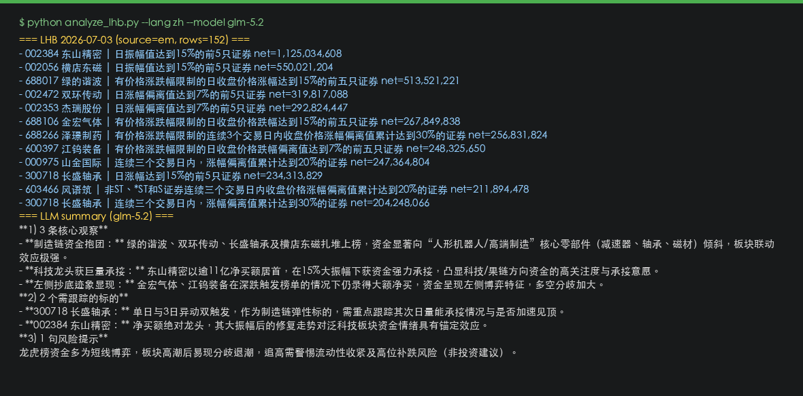

# 薅羊毛 · A股龙虎榜 × 智谱GLM5.2 / 千问3.7 / DeepSeek · OpenAI 兼容

用 **akshare** 免费拉 **A股龙虎榜**，再用 **智谱 GLM**、**千问 Qwen**、**DeepSeek** 等大模型一键总结。接口 **OpenAI 兼容**，国内直连，同一 Base URL 可切换 `gpt-5.5`、`claude-opus-4-8`、`gemini-3.5-flash` 等。

关键词：`glm-5.2` · `qwen3.7-max` · `deepseek-v4-pro` · `龙虎榜` · `量化` · `A股` · `OpenAI 兼容` · `国内直连`

---

## 快速运行

```bash
pip install -r requirements.txt
cp config.example.yaml config.yaml
# 编辑 config.yaml，填入控制台创建的 API Key
python analyze_lhb.py --lang zh
```

**推荐模型（config.yaml）：**

```yaml
LLM_BASE_URL: "https://www.qinghong.tech/v1"
LLM_MODEL: "glm-5.2"        # 也可改为 qwen3.7-max / deepseek-v4-pro / kimi-k2.7-code
LLM_API_KEY: "your-key-here"
```

仅看榜单、不调模型：`python analyze_lhb.py --no-llm --lang zh`

---

## 运行截图（2026-07-03 · `glm-5.2`）



---

## 注册与文档（晴红API · AI 中转）

| | 链接 |
|---|------|
| **注册** | https://www.qinghong.tech/sign-up |
| **Apifox 文档** | https://qinghongkeji.apifox.cn |
| **模型广场 / 定价** | https://www.qinghong.tech/pricing |

控制台创建 Key → 填入 `config.yaml` → 充值即用。模型名与模型广场一致（如 `glm-5.2`、`qwen3.7-max`）。

---

## 功能说明

1. 自动拉取最近交易日龙虎榜（东财 → 新浪回退）
2. 终端打印净买额靠前标的
3. 调用大模型输出中文要点摘要

仓库内 **零密钥**；行情来自 akshare 公开源，无需 Tushare 积分。

---

## 常用参数

```bash
python analyze_lhb.py --date 2026-07-02 --lang zh
python analyze_lhb.py --top 20 --lang zh
```

---

## 协议

MIT — 见 [LICENSE](LICENSE)。
