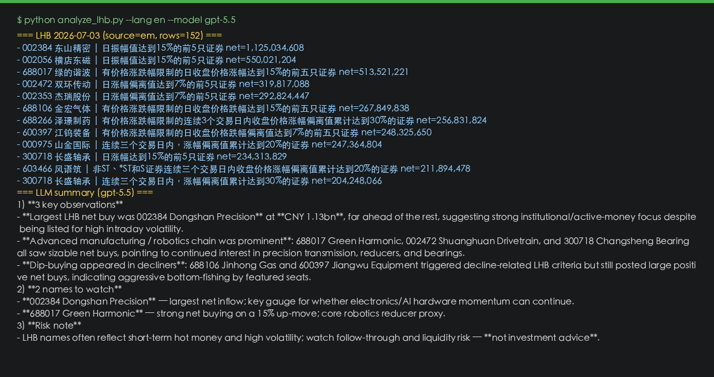

# China A-Share LHB Analyzer · Claude / GPT / Gemini via OpenAI-Compatible API

**中文说明 → [README.gitee.md](README.gitee.md)**（A股龙虎榜 · 智谱GLM / 千问 · OpenAI 兼容）

> For personal learning, quant research, and API integration testing only — **not investment advice**.

Fetch **China A-share Dragon Tiger List (LHB / 龙虎榜)** with [akshare](https://github.com/akfamily/akshare), then summarize with **Claude**, **GPT**, or **Gemini** through one **OpenAI-compatible** endpoint.

Keywords: `claude-opus-4-8` · `gpt-5.5` · `gemini-3.5-flash` · `OpenAI compatible` · `china stock` · `dragon tiger list` · `quant`

---

## Quick start

```bash
pip install -r requirements.txt
cp config.example.yaml config.yaml
# Edit config.yaml — set LLM_API_KEY from the console below
python analyze_lhb.py
```

**Default model in config:** `gpt-5.5` (switch to `claude-opus-4-8` or `gemini-3.5-flash` anytime).

```yaml
LLM_BASE_URL: "https://www.qinghong.tech/v1"
LLM_MODEL: "gpt-5.5"
LLM_API_KEY: "your-key-here"
```

Data only: `python analyze_lhb.py --no-llm`

---

## Demo (2026-07-03 · `gpt-5.5`)



---

## Get an API key (Qinghong · OpenAI-compatible)

| | Link |
|---|------|
| **Sign up** | https://www.qinghong.tech/sign-up |
| **API docs (Apifox)** | https://qinghongkeji.apifox.cn |
| **Models & pricing** | https://www.qinghong.tech/pricing |

One Base URL for Claude, GPT, Gemini, DeepSeek, GLM, Qwen — change `LLM_MODEL` only.

---

## What it does

1. Pull LHB for the latest trading day (Eastmoney → Sina fallback)
2. Print top names by net buy
3. Call your LLM via OpenAI SDK → structured summary

No bundled API keys. No paid market-data subscription required for the demo.

---

## Options

```bash
python analyze_lhb.py --date 2026-07-02
python analyze_lhb.py --lang zh
python analyze_lhb.py --top 15
```

---

## Disclaimer

This repository is provided **for personal learning, quantitative research, and OpenAI-compatible API integration testing only**. It does **not** constitute investment, financial, or trading advice.

- LLM-generated summaries may be incomplete or incorrect; do not rely on them for trading decisions.
- [Qinghong API](https://www.qinghong.tech) is an independent third-party service — you must supply your own API key and accept their terms and pricing.
- **Use at your own risk.** The authors assume no liability for losses or damages arising from use of this software.

中文说明与完整声明 → [README.gitee.md](README.gitee.md)

---

## License

MIT — see [LICENSE](LICENSE).
