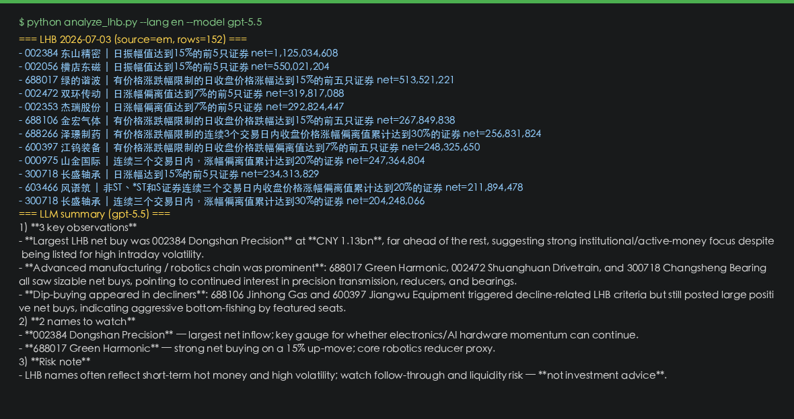

# China A-Share LHB Analyzer · Claude / GPT / Gemini via OpenAI-Compatible API

**中文说明 → [README.gitee.md](README.gitee.md)**（A股龙虎榜 · 智谱GLM / 千问 · OpenAI 兼容）

> For personal learning, quant research, and API integration testing only — **not investment advice**.

Fetch **China A-share Dragon Tiger List (LHB / 龙虎榜)** with [akshare](https://github.com/akfamily/akshare), then summarize with **Claude**, **GPT**, or **Gemini** through one **OpenAI-compatible** endpoint.

Keywords: `claude-opus-4-8` · `gpt-5.5` · `gemini-3.5-flash` · `OpenAI compatible` · `china stock` · `dragon tiger list` · `quant`

---

## Quick start

```bash
pip install -r requirements.txt
cp config.example.yaml config.yaml
# Edit config.yaml — set LLM_API_KEY from the console below
python analyze_lhb.py
```

**Default model in config:** `gpt-5.5` (switch to `claude-opus-4-8` or `gemini-3.5-flash` anytime).

```yaml
LLM_BASE_URL: "https://www.qinghong.tech/v1"
LLM_MODEL: "gpt-5.5"
LLM_API_KEY: "your-key-here"
```

Data only: `python analyze_lhb.py --no-llm`

---

## Demo (2026-07-03 · `gpt-5.5`)



---

## Get an API key (Qinghong · OpenAI-compatible)

| | Link |
|---|------|
| **Sign up** | https://www.qinghong.tech/sign-up |
| **API docs (Apifox)** | https://qinghongkeji.apifox.cn |
| **Models & pricing** | https://www.qinghong.tech/pricing |

One Base URL for Claude, GPT, Gemini, DeepSeek, GLM, Qwen — change `LLM_MODEL` only.

---

## What it does

1. Pull LHB for the latest trading day (Eastmoney → Sina fallback)
2. Print top names by net buy
3. Call your LLM via OpenAI SDK → structured summary

No bundled API keys. No paid market-data subscription required for the demo.

---

## Options

```bash
python analyze_lhb.py --date 2026-07-02
python analyze_lhb.py --lang zh
python analyze_lhb.py --top 15
```

---

## Disclaimer

This repository is provided **for personal learning, quantitative research, and OpenAI-compatible API integration testing only**. It does **not** constitute investment, financial, or trading advice.

- LLM-generated summaries may be incomplete or incorrect; do not rely on them for trading decisions.
- [Qinghong API](https://www.qinghong.tech) is an independent third-party service — you must supply your own API key and accept their terms and pricing.
- **Use at your own risk.** The authors assume no liability for losses or damages arising from use of this software.

中文说明与完整声明 → [README.gitee.md](README.gitee.md)

---

## License

MIT — see [LICENSE](LICENSE).

---


---

## Need live A-share market data? · A股行情 / 量化数据 API

This demo pulls LHB via **akshare** (free, best-effort). If you need a **hosted JSON API** for quotes / daily bars / indices / limit-up / moneyflow / LHB / fundamentals (A-share + domestic futures, subject to your plan):

| | Link |
|---|------|
| **Developer docs (Feishu)** | https://my.feishu.cn/wiki/WB5XwdSehi5Z3ikc6UfcgkyQnNd |
| Quick probe | `GET /v1/cn/quote?symbols=600519,000001` (needs `X-API-Key`) |
| Base (example) | `https://api.qinghong888.cc.cd` |

Trial / purchase: add WeChat **ziyouxiaoqi123** (note **GitHub-LHB**) — free group for Q&A; keys via Xianyu/Taobao.

**News / hot-rank for AI agents** (not quotes) → separate MVP: [finance-news-api-for-ai-agents](https://github.com/liudong317/finance-news-api-for-ai-agents)

## Community / 交流

If you use this repo for **A-share quant research**, **LHB (Dragon Tiger List) analysis**, or **OpenAI-compatible API** integration — welcome to join our free quant community (~100 members).

群内主要交流：数据接口用法、策略思路、部署踩坑、LLM 接入经验等。**仅供学习交流，不构成任何投资建议。**

- WeChat / 微信：**ziyouxiaoqi123**（备注 / note：**GitHub-LHB**）
- 或扫下方群二维码 / Scan the QR code below:


**相关链接（可选了解，不强推 / Optional links）：**
- A股行情 / 量化 API（飞书）：https://my.feishu.cn/wiki/WB5XwdSehi5Z3ikc6UfcgkyQnNd
- 智能体财经资讯 MVP 仓：https://github.com/liudong317/finance-news-api-for-ai-agents
- 50+ 资讯飞书文档：https://my.feishu.cn/wiki/T7XWwCxtIiOcLIkkXQbc5I1Tntc
- Apifox：https://oljdijncb6.apifox.cn/
- 状态页：https://status.xiaobao317.site/
- LLM 中转：https://www.qinghong.tech/

> 群内仅交流；API Key 请走闲鱼/淘宝正规渠道购买。

> **另招代理，你不需要花费任何费用，各个平台可挂（如闲鱼，小红书，淘宝等平台），每天只需维护平台，养号就行，卖出去，前期3:7分，如果量大可再议价，联系客服👆，备注来意，无标明不回。**
